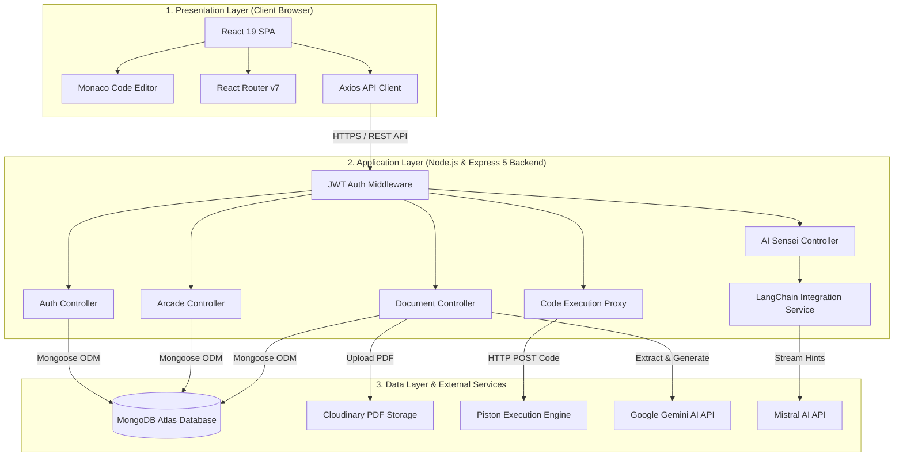
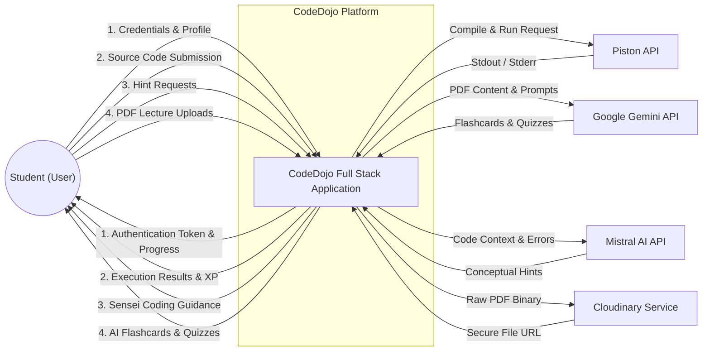
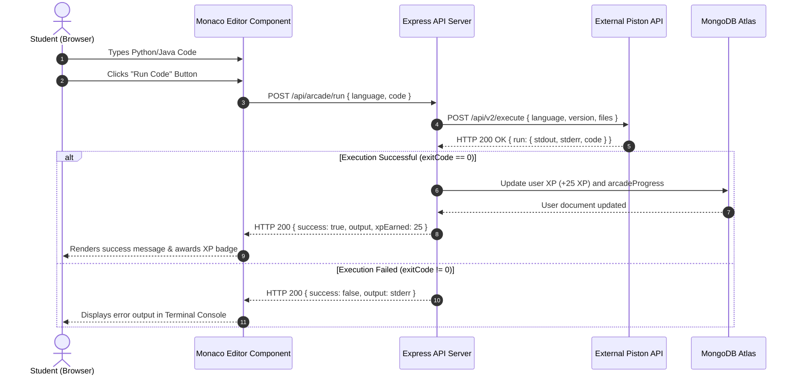
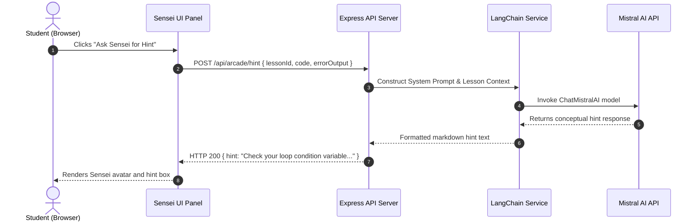
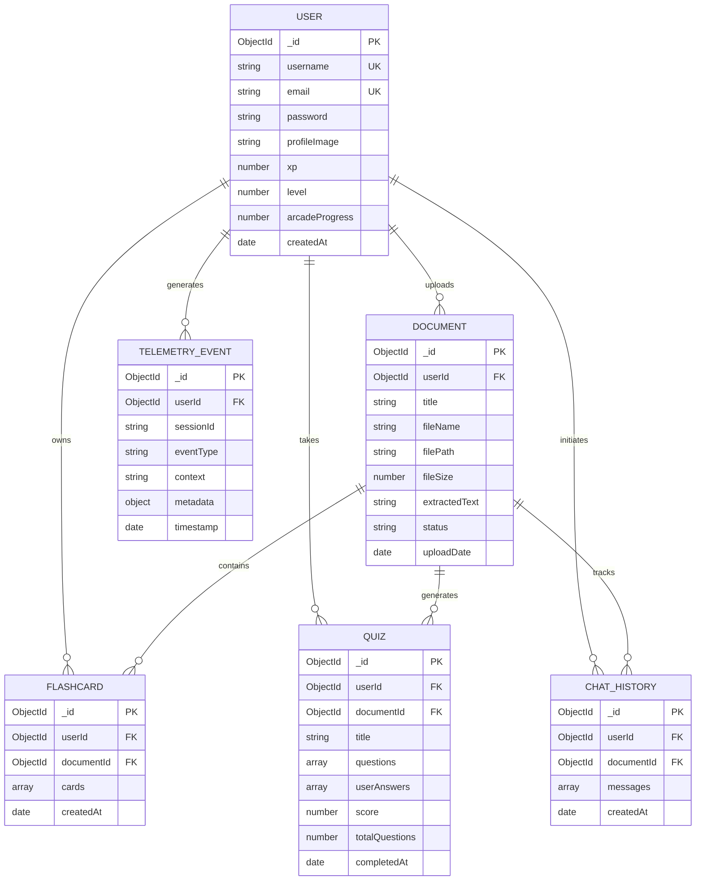
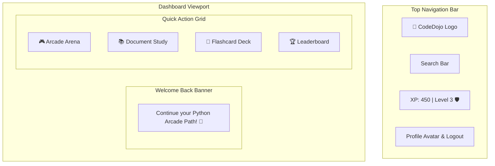
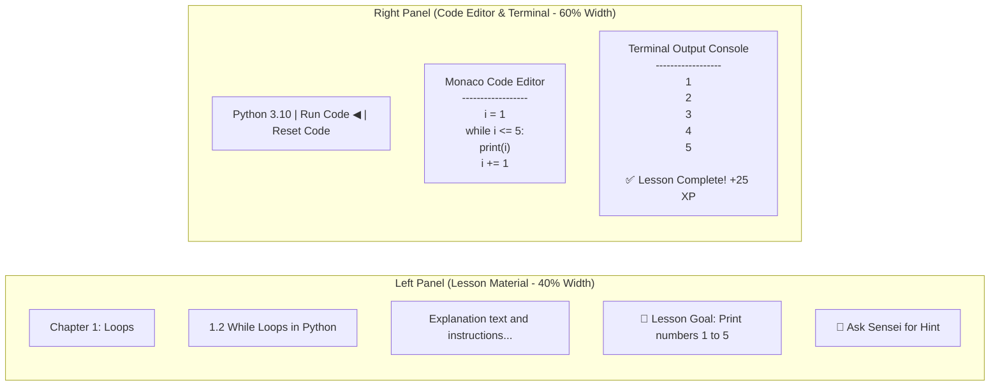

# CodeDojo Arcade - Technical Software Design Document (SDD)

**Document Standard:** IEEE Std 1016 - Technical Sections  
**Project Name:** CodeDojo Arcade  
**Target Platform:** Web Browsers (React 19 Frontend, Node.js/Express 5 Backend, MongoDB Atlas)  
**Date:** September 2026  

---

## Table of Contents
- [3.0 SYSTEM ARCHITECTURE](#30-system-architecture)
  - [3.1 Architectural Design](#31-architectural-design)
  - [3.2 Decomposition Description](#32-decomposition-description)
  - [3.3 Design Rationale](#33-design-rationale)
- [4.0 DATA DESIGN](#40-data-design)
  - [4.1 Data Description](#41-data-description)
  - [4.2 Data Dictionary](#42-data-dictionary)
- [5.0 COMPONENT DESIGN](#50-component-design)
  - [5.1 Authentication Subsystem](#51-authentication-subsystem)
  - [5.2 Dojo Path & Code Execution Subsystem](#52-dojo-path--code-execution-subsystem)
  - [5.3 AI Sensei Mentor Subsystem](#53-ai-sensei-mentor-subsystem)
  - [5.4 Document Study & Quiz Generation Subsystem](#54-document-study--quiz-generation-subsystem)
- [6.0 HUMAN INTERFACE DESIGN](#60-human-interface-design)
  - [6.1 Overview of User Interface](#61-overview-of-user-interface)
  - [6.2 Screen Layout Diagrams](#62-screen-layout-diagrams)
  - [6.3 Screen Objects and Actions](#63-screen-objects-and-actions)
- [7.0 REQUIREMENTS MATRIX](#70-requirements-matrix)
- [8.0 APPENDICES](#80-appendices)
  - [Appendix A: User Interface Testing Checklist](#appendix-a-user-interface-testing-checklist)
  - [Appendix B: Technical API Endpoint Reference](#appendix-b-technical-api-endpoint-reference)

---

## 3.0 SYSTEM ARCHITECTURE

### 3.1 Architectural Design

CodeDojo follows a 3-tier client-server architecture built on the MERN stack (MongoDB, Express, React, Node.js) combined with external micro-services for code execution, AI processing, and cloud file storage.

The architecture separates responsibilities into three distinct layers:
1. **Presentation Layer (Frontend):** A single-page application built with React 19, Vite, and Monaco Editor. It handles user interactions, client-side routing, and live code rendering.
2. **Application & API Layer (Backend):** A RESTful API built with Express.js v5 and Node.js. It handles authentication, business logic, gamification rules, AI prompt chaining (via LangChain), and acts as a secure proxy to external APIs.
3. **Data & External Services Layer:** MongoDB Atlas for persistence, Cloudinary for file hosting, Piston API for isolated code execution, Google Gemini API for document parsing, and Mistral AI for AI mentorship.

#### System Architecture Diagram



---

### 3.2 Decomposition Description

The system is decomposed into five core subsystems:
1. **User Authentication & Profile Management:** Manages user signup, login, JWT token issuance, password hashing, and user profile data.
2. **Dojo Path Coding Arena:** Provides programming lesson paths (Python and Java), manages sequential lesson progression, starter code delivery, and code execution.
3. **AI Sensei Mentorship:** Analyzes student code and runtime terminal errors using Mistral AI to return non-spoiler hints.
4. **Document Study Suite:** Accepts PDF lecture uploads, stores files in Cloudinary, extracts text, and generates AI summaries, flashcards, and quizzes using Google Gemini.
5. **Gamification Engine:** Tracks user Experience Points (XP), calculates dynamic user levels, updates daily login streaks, and maintains a real-time top 50 leaderboard.

#### Subsystem Decomposition Hierarchy

```mermaid
graph TD
    System["CodeDojo Arcade Platform"]

    SubAuth["1. Auth & Profile Subsystem"]
    SubArcade["2. Dojo Path Subsystem"]
    SubAI["3. Sensei AI Subsystem"]
    SubDoc["4. Document Study Subsystem"]
    SubGame["5. Gamification Subsystem"]

    System --> SubAuth
    System --> SubArcade
    System --> SubAI
    System --> SubDoc
    System --> SubGame

    SubAuth --> Auth1["User Registration & Password Hashing"]
    SubAuth --> Auth2["JWT Session Management"]

    SubArcade --> Arc1["Lesson Progress Tracking"]
    SubArcade --> Arc2["Monaco Editor State"]
    SubArcade --> Arc3["Piston Execution Proxy"]

    SubAI --> AI1["Context Builder"]
    SubAI --> AI2["Mistral Hint Generator"]
    SubAI --> AI3["Chat History Tracker"]

    SubDoc --> Doc1["PDF Upload & Cloudinary Proxy"]
    SubDoc --> Doc2["Gemini Text Processing"]
    SubDoc --> Doc3["Flashcard & Quiz Generator"]

    SubGame --> Game1["XP Calculation Engine"]
    SubGame --> Game2["Level Scaler"]
    SubGame --> Game3["Global Leaderboard"]
```



#### Data Flow Diagrams (DFDs)

##### DFD Level 0: Overall System Context Diagram



##### DFD Level 1: Code Execution & Gamification Data Flow

```mermaid
graph TD
    User(("Student"))
    
    P1["1.0 Monaco Editor UI"]
    P2["2.0 Execute Controller"]
    P3["3.0 Piston Execution Engine"]
    P4["4.0 Gamification Engine"]
    
    D1[("MongoDB: User Collection")]
    
    User -->|Submits Code| P1
    P1 -->|POST /api/arcade/run| P2
    P2 -->|HTTP Request {language, code}| P3
    P3 -->|Returns {stdout, stderr, exitCode}| P2
    P2 -->|Display Terminal Output| P1
    
    P2 -->|If exitCode == 0 & Passed| P4
    P4 -->|Calculate XP & Level| D1
    D1 -->|Updated User Stats| P1
```

#### System Sequence Diagrams

##### Sequence Diagram 1: Code Submission and Execution Flow



##### Sequence Diagram 2: AI Sensei Hint Request Flow



---

### 3.3 Design Rationale

The architectural decisions for CodeDojo were selected based on technical feasibility, performance, and security:

1. **Client-Side Rendering (React 19 + Vite):**
   - *Rationale:* A single-page application structure allows instant split-screen layout switching (editor vs lesson material) without full page reloads, saving browser memory and providing a native desktop-editor feel.

2. **Stateless JWT Authentication:**
   - *Rationale:* Storing user session data in signed JSON Web Tokens (7-day expiration) eliminates server-side session memory overhead, allowing horizontal backend scaling.

3. **External Isolated Code Execution (Piston API):**
   - *Rationale:* Executing arbitrary untrusted user code (Python/Java) directly on the backend server introduces major security vulnerabilities (fork bombs, file deletion, server takeover). Routing executions to a sandboxed Piston container enforces strict execution timeouts (10 seconds) and memory limits (128 MB).

4. **Multi-Model AI Separation (Google Gemini + Mistral AI):**
   - *Rationale:* Google Gemini handles long-context text processing (parsing large PDF lecture slides for flashcards/quizzes). Mistral AI (Codestral) is specifically optimized for code analysis and programming instruction, making it ideal for the Sensei AI mentor.

5. **MongoDB NoSQL Database:**
   - *Rationale:* Student progress, dynamic quiz option arrays, and nested flashcards fit document structures naturally, avoiding costly multi-table SQL JOIN queries.

---

## 4.0 DATA DESIGN

### 4.1 Data Description

Data persistence is managed using MongoDB Atlas via Mongoose ODM (Object Data Modeling). All sensitive data (passwords) are hashed using `bcryptjs` with 10 salt rounds before persistence.

#### Entity-Relationship Diagram (ERD)



---

### 4.2 Data Dictionary

Below is the complete data dictionary listing system entities, attributes, data types, validation rules, default values, and index specifications.

#### Table 1: User Schema (`User.js`)
*Represents student user profiles, credentials, and gamification status.*

| Field Name | Data Type | Key Type | Required | Default Value | Validation & Notes |
| :--- | :--- | :--- | :--- | :--- | :--- |
| `_id` | ObjectId | Primary Key | Yes | Auto-generated | Unique document identifier. |
| `username` | String | Unique Key | Yes | None | Min length 3 chars, trimmed. |
| `email` | String | Unique Key | Yes | None | Valid email regex pattern, lowercase. |
| `password` | String | None | Yes | None | Min length 6 chars, `select: false` by default, hashed via bcrypt. |
| `profileImage` | String | None | No | `null` | URL path to user avatar. |
| `xp` | Number | None | No | `0` | Total Experience Points earned. |
| `level` | Number | None | No | `1` | Calculated level: $\lfloor \sqrt{\text{XP} / 100} \rfloor + 1$. |
| `badges` | Array[Object] | None | No | `[]` | Array of `{ name, icon, dateAwarded }`. |
| `arcadeProgress`| Number | None | No | `0` | Total arcade challenges completed. |
| `createdAt` | Date | None | No | `Date.now` | Auto timestamp. |
| `updatedAt` | Date | None | No | `Date.now` | Auto timestamp. |

*Indexes:* Unique index on `username` and `email`.

---

#### Table 2: Document Schema (`Document.js`)
*Stores PDF metadata and extracted text from student uploads.*

| Field Name | Data Type | Key Type | Required | Default Value | Validation & Notes |
| :--- | :--- | :--- | :--- | :--- | :--- |
| `_id` | ObjectId | Primary Key | Yes | Auto-generated | Unique document identifier. |
| `userId` | ObjectId | Foreign Key | Yes | None | References `User._id`. |
| `title` | String | None | Yes | None | Trimmed display title. |
| `fileName` | String | None | Yes | None | Original filename. |
| `filePath` | String | None | Yes | None | Cloudinary secure URL. |
| `fileSize` | Number | None | Yes | None | Size in bytes (max 10MB limit). |
| `extractedText` | String | None | No | `""` | Plain text parsed from PDF. |
| `chunks` | Array[Object] | None | No | `[]` | Parsed text chunks: `{ content, pageNumber, chunkIndex }`. |
| `status` | String | None | No | `"processing"` | Enum: `["processing", "ready", "failed"]`. |
| `uploadDate` | Date | None | No | `Date.now` | Upload timestamp. |
| `lastAccessed` | Date | None | No | `Date.now` | Last view timestamp. |

*Indexes:* Compound index on `{ userId: 1, uploadDate: -1 }`.

---

#### Table 3: Flashcard Schema (`Flashcard.js`)
*Stores study cards generated from uploaded documents.*

| Field Name | Data Type | Key Type | Required | Default Value | Validation & Notes |
| :--- | :--- | :--- | :--- | :--- | :--- |
| `_id` | ObjectId | Primary Key | Yes | Auto-generated | Unique set identifier. |
| `userId` | ObjectId | Foreign Key | Yes | None | References `User._id`. |
| `documentId` | ObjectId | Foreign Key | Yes | None | References `Document._id`. |
| `cards` | Array[Object] | None | Yes | `[]` | Objects containing `{ question, answer, difficulty, reviewCount, isStarred }`. |
| `cards.difficulty`| String | None | No | `"medium"` | Enum: `["easy", "medium", "hard"]`. |
| `cards.isStarred` | Boolean | None | No | `false` | User favorite bookmark flag. |

*Indexes:* Compound index on `{ userId: 1, documentId: 1 }`.

---

#### Table 4: Quiz Schema (`Quiz.js`)
*Stores multiple-choice questions, user selections, and final scores.*

| Field Name | Data Type | Key Type | Required | Default Value | Validation & Notes |
| :--- | :--- | :--- | :--- | :--- | :--- |
| `_id` | ObjectId | Primary Key | Yes | Auto-generated | Unique quiz identifier. |
| `userId` | ObjectId | Foreign Key | Yes | None | References `User._id`. |
| `documentId` | ObjectId | Foreign Key | Yes | None | References `Document._id`. |
| `title` | String | None | Yes | None | Quiz title. |
| `questions` | Array[Object] | None | Yes | `[]` | Question objects: `{ question, options, correctAnswer, explanation, difficulty }`. |
| `questions.options`| Array[String]| None | Yes | None | Must contain exactly 4 options. |
| `userAnswers` | Array[Object] | None | No | `[]` | Answer logs: `{ questionIndex, selectedAnswer, isCorrect, answeredAt }`. |
| `score` | Number | None | No | `0` | Percentage or count score achieved. |
| `totalQuestions`| Number | None | Yes | None | Total question count. |
| `completedAt` | Date | None | No | `null` | Completion timestamp. |

*Indexes:* Compound index on `{ userId: 1, documentId: 1 }`.

---

#### Table 5: Chat History Schema (`ChatHistory.js`)
*Stores document QA chat conversations between student and AI assistant.*

| Field Name | Data Type | Key Type | Required | Default Value | Validation & Notes |
| :--- | :--- | :--- | :--- | :--- | :--- |
| `_id` | ObjectId | Primary Key | Yes | Auto-generated | Unique chat log identifier. |
| `userId` | ObjectId | Foreign Key | Yes | None | References `User._id`. |
| `documentId` | ObjectId | Foreign Key | Yes | None | References `Document._id`. |
| `messages` | Array[Object] | None | Yes | `[]` | Message logs: `{ role, content, timestamp, relevantChunks }`. |
| `messages.role` | String | None | Yes | None | Enum: `["user", "assistant"]`. |

*Indexes:* Compound index on `{ userId: 1, documentId: 1 }`.

---

#### Table 6: Telemetry Event Schema (`TelemetryEvent.js`)
*Tracks platform usage metrics and analytics events.*

| Field Name | Data Type | Key Type | Required | Default Value | Validation & Notes |
| :--- | :--- | :--- | :--- | :--- | :--- |
| `_id` | ObjectId | Primary Key | Yes | Auto-generated | Event record identifier. |
| `userId` | ObjectId | Foreign Key | No | `null` | Optional reference to `User._id`. |
| `sessionId` | String | None | Yes | None | Client session UUID string. |
| `eventType` | String | None | Yes | None | Event classification string. |
| `context` | String | None | Yes | None | View or module context. |
| `metadata` | Object | None | No | `{}` | Key-value event payload. |
| `timestamp` | Date | None | No | `Date.now` | Event occurrence timestamp. |

---

## 5.0 COMPONENT DESIGN

This section outlines the procedural logic and algorithm summaries for core backend controllers using Procedural Description Language (PDL) / Pseudocode.

### 5.1 Authentication Subsystem (`authController.js`)

```text
ALGORITHM RegisterUser(username, email, password):
    INPUT: string username, string email, string password
    OUTPUT: JSON response with user object and JWT token

    1. IF username OR email OR password is missing THEN
          RETURN Error (400, "Please provide all required fields")
    2. Normalize email = lowercase(trim(email))
    3. CHECK IF User exists in DB with matching email OR username
    4. IF user exists THEN
          RETURN Error (400, "User already exists with this email or username")
    5. CREATE new User object with { username, email, password }
    6. SAVE user to DB (Pre-save hook hashes password using bcrypt with 10 salt rounds)
    7. GENERATE JWT Token signed with JWT_SECRET, expiration = 7 days
    8. RETURN HTTP 201 Created { success: true, token, user: { id, username, email, level, xp } }
END ALGORITHM
```

---

### 5.2 Dojo Path & Code Execution Subsystem (`executeController.js` & `arcadeController.js`)

```text
ALGORITHM ExecuteStudentCode(userId, language, code, lessonId):
    INPUT: string userId, string language, string code, string lessonId
    OUTPUT: JSON response with stdout, stderr, and XP status

    1. VALIDATE language IS IN ['python', 'java']
    2. IF code IS empty THEN
          RETURN Error (400, "Code submission cannot be empty")
    3. CONSTRUCT payload for Piston API:
          { language: language, version: "*", files: [{ content: code }] }
    4. SEND HTTP POST request to Piston API (Timeout: 10 seconds)
    5. RECEIVE response { run: { stdout, stderr, code: exitCode } }
    6. IF exitCode == 0 AND stderr IS empty THEN
          // Verified execution success
          IF lessonId IS provided THEN
              FETCH User record by userId
              AWARD XP: user.xp = user.xp + 25
              RECALCULATE Level: user.level = floor(sqrt(user.xp / 100)) + 1
              UPDATE user.arcadeProgress
              SAVE User record to DB
          END IF
          RETURN HTTP 200 { success: true, output: stdout, xpAwarded: 25 }
       ELSE
          // Execution error occurred
          RETURN HTTP 200 { success: false, output: stderr, exitCode: exitCode }
       END IF
END ALGORITHM
```

---

### 5.3 AI Sensei Mentor Subsystem (`aiController.js` / `langchain.service.js`)

```text
ALGORITHM GetSenseiHint(userId, lessonId, studentCode, errorOutput):
    INPUT: string userId, string lessonId, string studentCode, string errorOutput
    OUTPUT: String markdown formatted non-spoiler hint

    1. FETCH lesson details (title, objective, starterCode) for lessonId
    2. CONSTRUCT System Prompt:
          "You are Sensei, a encouraging coding mentor. 
           Guide the student to solve their code error WITHOUT giving direct code solutions."
    3. BUILD User Context Prompt:
          - Lesson Objective: lesson.objective
          - Student Code: studentCode
          - Terminal Error: errorOutput
    4. CALL Mistral AI API via LangChain ChatMistralAI model
    5. RECEIVE stream response from Mistral AI
    6. LOG telemetry event { type: "AI_HINT_REQUEST", userId, lessonId }
    7. RETURN HTTP 200 { hint: AIResponseText }
END ALGORITHM
```

---

### 5.4 Document Study & Quiz Generation Subsystem (`documentController.js`)

```text
ALGORITHM GenerateQuizFromDocument(userId, documentId):
    INPUT: string userId, string documentId
    OUTPUT: JSON object containing 5 generated multiple-choice quiz questions

    1. FETCH Document from DB where _id == documentId AND userId == userId
    2. IF Document NOT FOUND OR status != 'ready' THEN
          RETURN Error (404, "Document not ready or not found")
    3. EXTRACT document text = Document.extractedText
    4. CONSTRUCT Gemini Prompt:
          "Generate 5 multiple-choice questions from this text.
           Return strict JSON array format:
           [{ question, options: [4 strings], correctAnswer, explanation, difficulty }]"
    5. CALL Google Gemini API (gemini-2.5-flash-lite)
    6. PARSE response string into JSON object array
    7. CREATE new Quiz document in DB linked to userId and documentId
    8. SAVE Quiz to DB
    9. RETURN HTTP 201 Created { quizId: quiz._id, questions: quiz.questions }
END ALGORITHM
```

---

## 6.0 HUMAN INTERFACE DESIGN

### 6.1 Overview of User Interface

CodeDojo's user interface is designed for high readability, minimal friction, and visual engagement:
- **Design Aesthetic:** Modern dark-mode interface using curated primary colors (Deep Slate background `#0f172a`, Emerald Accent `#10b981`, Indigo Accent `#6366f1`).
- **Typography:** Inter & Roboto sans-serif fonts for crisp interface text; Fira Code monospace font inside the Monaco Code Editor.
- **Layout Structure:** Fixed sidebar navigation drawer on the left, sticky top header displaying student level/XP progress, and main dynamic viewport area.

---

### 6.2 Screen Layout Diagrams

#### 1. Dashboard Layout



#### 2. Dojo Path Split-Screen Coding Arena



---

### 6.3 Screen Objects and Actions

| Screen Name | UI Component / Object | Associated User Action | Triggered System Event / API Call |
| :--- | :--- | :--- | :--- |
| **Login View** | Email & Password Inputs | User enters credentials & clicks "Login" | `POST /api/auth/login` → JWT stored in localStorage |
| **Dojo Path** | "Run Code" Button | User clicks button | `POST /api/arcade/run` → Piston proxy execution |
| **Dojo Path** | "Ask Sensei" Button | User requests guidance | `POST /api/arcade/hint` → Mistral AI prompt |
| **Document Studio**| PDF Upload Drag-Zone | User drops PDF file (max 10MB) | `POST /api/documents/upload` → Cloudinary upload |
| **Document Studio**| "Generate Flashcards" | User clicks button | `POST /api/flashcards/generate` → Gemini text parsing |
| **Quiz View** | Option Radio Buttons | User selects answer for question $N$ | Local state selection update |
| **Quiz View** | "Submit Quiz" Button | User submits complete test | `POST /api/quizzes/:id/submit` → Calculates final score |
| **Leaderboard** | Global Filter Tabs | User switches between "Top 50" & "Friends" | `GET /api/leaderboard?filter=top50` → Renders list |

---

## 7.0 REQUIREMENTS MATRIX

This matrix traces functional requirements from the Software Requirements Specification (SRS) directly to technical design components, database entities, and API endpoints.

| Requirement ID | Requirement Summary | Target Subsystem | Database Entity | API Endpoint / Controller |
| :--- | :--- | :--- | :--- | :--- |
| **REQ-AUTH-1** | User registration with unique email & password. | Auth Subsystem | `User` Model | `POST /api/auth/register` |
| **REQ-AUTH-2** | User authentication issuing a 7-day JWT token. | Auth Subsystem | `User` Model | `POST /api/auth/login` |
| **REQ-ARC-1** | Select between Python and Java curriculum paths. | Dojo Path Subsystem | N/A (Static Curriculum)| `GET /api/arcade/tracks` |
| **REQ-ARC-2** | Live in-browser Monaco Editor integration. | Dojo Path Subsystem | N/A (Client State) | React Component (`MonacoEditor`) |
| **REQ-ARC-3** | Isolated execution of student code via Piston. | Execution Subsystem | N/A (External API) | `POST /api/arcade/run` |
| **REQ-AI-1** | Non-spoiler Sensei AI mentorship hints. | Sensei AI Subsystem | `ChatHistory` Model | `POST /api/arcade/hint` |
| **REQ-DOC-1** | PDF upload and cloud storage (up to 10MB). | Document Subsystem | `Document` Model | `POST /api/documents/upload` |
| **REQ-DOC-2** | Automated flashcard generation via Gemini AI. | Document Subsystem | `Flashcard` Model | `POST /api/documents/:id/flashcards` |
| **REQ-DOC-3** | Automated 4-option quiz generation via Gemini AI. | Document Subsystem | `Quiz` Model | `POST /api/documents/:id/quiz` |
| **REQ-GAME-1** | Award XP on verified lesson completion. | Gamification Engine | `User` Model | `arcadeController.js` |
| **REQ-GAME-2** | Dynamic level formula: $\lfloor \sqrt{\text{XP} / 100} \rfloor + 1$. | Gamification Engine | `User.level` Field | `User.js` Mongoose Helper |
| **REQ-GAME-3** | Real-time global XP Leaderboard ranking. | Gamification Engine | `User` Model | `GET /api/leaderboard` |

---

## 8.0 APPENDICES

### Appendix A: User Interface Testing Checklist

This checklist must be executed by Quality Assurance (QA) testers during UI validation iterations.

```
USER INTERFACE TESTING CHECKLIST
================================

1. USER INTERFACE

1.1 COLORS
[ ] 1.1.1 Are hyperlink colors standard and clearly recognizable?
[ ] 1.1.2 Are the field backgrounds the correct color (e.g. contrast against text)?
[ ] 1.1.3 Are the field prompts the correct color and readable?
[ ] 1.1.4 Are screen and field colors adjusted correctly for non-editable / read-only mode?
[ ] 1.1.5 Does the site use (approximately) standard link hover/active colors?
[ ] 1.1.6 Are all buttons in standard format and uniform size across screens?
[ ] 1.1.7 Is the general screen background the correct dark slate `#0f172a` color?
[ ] 1.1.8 Is the page background color distraction-free?

1.2 CONTENT
[ ] 1.2.1 Are all screen fonts uniform and consistent across pages?
[ ] 1.2.2 Are all screen prompts specified in the correct screen font?
[ ] 1.2.3 Does content remain intact when navigating backward or forward between pages?
[ ] 1.2.4 Is all interface text properly aligned (left/center/right grid alignment)?
[ ] 1.2.5 Is text in all editable input fields specified in the correct screen font?
[ ] 1.2.6 Are all main section headings left-aligned?
[ ] 1.2.7 Does the first letter of the second word appear in lowercase where camelCase/sentence case is specified?

1.3 IMAGES
[ ] 1.3.1 Are all graphics, badges, and icons properly aligned with adjacent text?
[ ] 1.3.2 Are graphics optimized for efficient file size (WebP/SVG formats)?
[ ] 1.3.3 Are graphics optimized for quick downloads on standard web connections?
[ ] 1.3.4 Are command buttons of uniform size, shape, font style, and font size?
[ ] 1.3.5 Are banner styles, sizes, and displays visually consistent with existing windows?
[ ] 1.3.6 Does text wrap properly around pictures, graphic elements, and Sensei avatars?
[ ] 1.3.7 Is the user interface visually readable and usable even if image loading fails?

1.4 INSTRUCTIONS
[ ] 1.4.1 Is all error message text spelt correctly across all screens?
[ ] 1.4.2 Is all micro-help text (i.e. tooltips) spelt correctly across screens?
[ ] 1.4.3 Is micro-help text (tooltip) provided for every enabled field & button?
[ ] 1.4.4 Are progress indicators/spinners displayed on load of tabbed and active screens?

1.5 NAVIGATION
[ ] 1.5.1 Are all disabled fields skipped in the TAB key sequence?
[ ] 1.5.2 Are all read-only fields skipped in the TAB key sequence?
[ ] 1.5.3 Can all screens accessible via navigation buttons be accessed correctly?
[ ] 1.5.4 Does a custom scrollbar appear automatically when content overflows container bounds?
[ ] 1.5.5 Does the Tab Order specified go sequentially from Top-Left to Bottom-Right?
[ ] 1.5.6 Is there a link/button to return Home or to the Dashboard on every single page?
[ ] 1.5.7 On opening a tab/form, does focus land automatically on the first editable field?
[ ] 1.5.8 When an error occurs, does focus return to the field in error upon dismiss/cancel?

1.6 USABILITY
[ ] 1.6.1 Are all field prompts spelt correctly?
[ ] 1.6.2 Are typography font sizes comfortably legible (not too large or too small)?
[ ] 1.6.3 Are names on command buttons and option boxes spelled out without cryptic abbreviations?
[ ] 1.6.4 Are option boxes, radio buttons, and action buttons logically grouped in demarcated cards?
[ ] 1.6.5 Can a first-year student run the system without confusion or frustration?
[ ] 1.6.6 Do pages print legibly without clipping or cutting off text?
[ ] 1.6.7 Does the platform convey a clear visual sense of its intended student learning audience?
[ ] 1.6.8 Does the platform maintain a consistent, recognizable "look-and-feel" across modules?
[ ] 1.6.9 Can members log into the system using either UserName or Email ID?
[ ] 1.6.10 Does the site render cleanly on different display resolutions (e.g. 1024x768, 1920x1080)?
[ ] 1.6.11 Is all terminology easy to understand for first-year programming students?
```

---

### Appendix B: Technical API Endpoint Reference

| HTTP Method | Route Endpoint | Middleware | Controller Action | Description |
| :--- | :--- | :--- | :--- | :--- |
| `POST` | `/api/auth/register` | None | `register` | Registers a new student account. |
| `POST` | `/api/auth/login` | None | `login` | Authenticates user & issues JWT. |
| `GET` | `/api/auth/me` | `protect` | `getMe` | Returns authenticated user profile. |
| `POST` | `/api/arcade/run` | `protect` | `executeCode` | Proxies code to Piston API & updates XP. |
| `POST` | `/api/arcade/hint` | `protect` | `getSenseiHint` | Streaming AI mentor hint via Mistral. |
| `POST` | `/api/documents/upload` | `protect`, `multer`| `uploadDocument`| Uploads PDF to Cloudinary & parses text. |
| `POST` | `/api/documents/:id/quiz`| `protect` | `generateQuiz` | Generates 5-question quiz via Gemini. |
| `GET` | `/api/leaderboard` | `protect` | `getLeaderboard` | Returns Top 50 global student ranking. |
